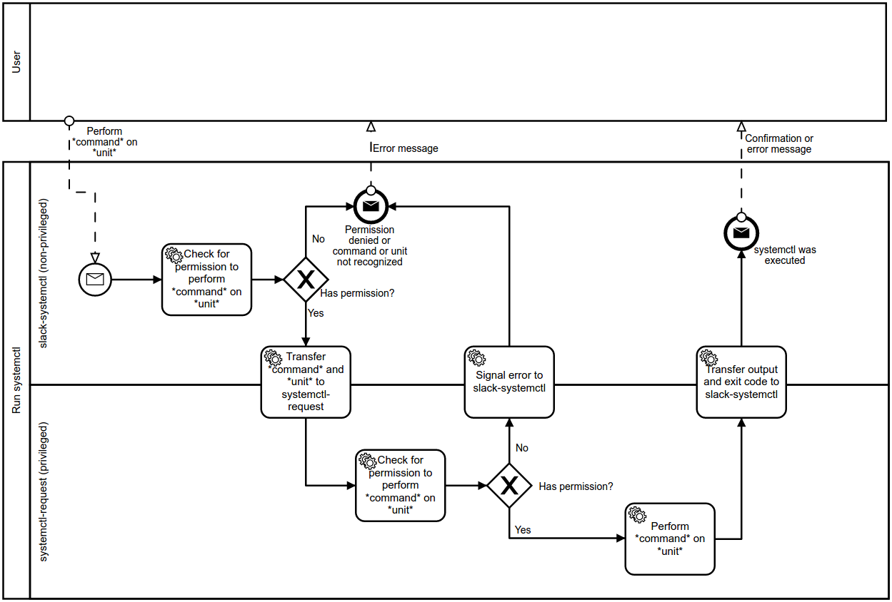

# Slack systemd Control
Control a unit file from Slack

## Usage

### Setup

1. Run `git clone URL`.
2. Run `cd FOLDER`.
3. Run `make setup` and follow the prompts.
4. Run `make sudoers`.
5. Run `sudoedit` and paste the output of the previous command somewhere in the configuration. Save and close.
4. Run `sudo make deploy`.
5. Run `sudo systemctl start slack-systemctl` to start the program
   (it should start automatically on startup).

### Changing the configuration

1. Change the configuration file(s) (not the ones in templates).
2. Update the sudoers file if you changed what units and commands are permitted:
   
   1. Run `make sudoers`.
   2. Run `sudoedit` and replace the existing section on slack-systemctl with the output of the previous command. Save and close.
3. Restart the application: `sudo systemctl restart slack-systemctl`

### Slack-usage

You use a special keyword to communicate with slack-systemctl regarding
a specific unit. That is, one keyword per unit. Write `KEYWORD help` for
a usage description.

Note that the reply from the slackbot will be posted to a specific channel,
no matter where the original message was sent. The reason for this is to
ensure that no one turns off a service in secret.

## Development

### Overview

### Quick explaination

The application monitors the Slack channels the bot is invited to, and reacts to a keyword. Upon receiving a message with
the keyword, it will try to determine whether it is allowed to perform the action before running 
`sudo --non-interactive systemctl COMMAND UNIT`. However, instead of granting the application full root privileges, the sudoers
file is used to grant the application permission to execute only those commands users are allowed to execute. This means that even
if the application is compromised, it does not grant the attacker access to the entire server.
